# SQL Server Backup & Point-in-Time Recovery Lab

Laboratório reproduzível de backup, restore e recuperação point-in-time no Microsoft SQL Server. O projeto cria uma base isolada, estabelece uma cadeia de backups, simula uma exclusão acidental e recupera o estado anterior em uma segunda base para permitir validação sem sobrescrever a origem.

## Visão geral

| Item | Descrição |
|---|---|
| Plataforma-alvo | SQL Server 2019 ou superior, edições Developer, Standard ou Enterprise |
| Linguagem | T-SQL com variáveis SQLCMD |
| Estratégia | Full + Differential + Transaction Log |
| Incidente simulado | Exclusão de uma linha crítica |
| Recuperação | Point-in-time com `STOPAT` |
| Destino do restore | `DBARecoveryLab_Restore` |
| Validação | Comparação entre base afetada e base recuperada |
| Automação do repositório | GitHub Actions com validação estática em PowerShell |

## Cenário

Uma transação crítica é confirmada na base `DBARecoveryLab`. Depois da criação dos backups full, diferencial e de log, a linha correspondente é excluída acidentalmente. Um novo backup de log captura o incidente.

A recuperação restaura a cadeia em `DBARecoveryLab_Restore` e interrompe a aplicação do último log no instante imediatamente anterior à exclusão. A base original permanece disponível para comparação.

## Arquitetura do laboratório

```mermaid
flowchart LR
    A[Base de laboratório] --> B[Backup full]
    B --> C[Alterações controladas]
    C --> D[Backup diferencial]
    D --> E[Transação crítica]
    E --> F[Backup de log]
    F --> G[Checkpoint de recuperação]
    G --> H[Exclusão acidental]
    H --> I[Log do incidente]
    I --> J[Restore em base alternativa]
    J --> K[STOPAT antes da exclusão]
    K --> L[Validação comparativa]
```



## O que o projeto demonstra

- configuração do recovery model `FULL`;
- criação de backups com `CHECKSUM` e `COMPRESSION`;
- validação do backup full com `RESTORE VERIFYONLY`;
- construção de uma cadeia full, diferencial e log;
- registro de um ponto de recuperação anterior ao incidente;
- restore com `NORECOVERY`, `MOVE` e aplicação ordenada da cadeia;
- recuperação point-in-time com `STOPAT`;
- validação objetiva da linha recuperada;
- consulta do histórico de backup e restore no `msdb`;
- limpeza protegida e limitada às bases do laboratório.

## Estrutura

```text
.
|-- .github/workflows/validate.yml
|-- docs/
|   |-- RUNBOOK.md
|   `-- TROUBLESHOOTING.md
|-- scripts/
|   |-- config.sql
|   |-- 00-preflight.sql
|   |-- 01-create-lab.sql
|   |-- 02-full-backup.sql
|   |-- 03-differential-backup.sql
|   |-- 04-log-backup.sql
|   |-- 05-simulate-incident.sql
|   |-- 06-point-in-time-restore.sql
|   |-- 07-validate-recovery.sql
|   |-- 08-audit-history.sql
|   `-- 99-cleanup.sql
`-- tools/Test-Repository.ps1
```

## Pré-requisitos

- SQL Server 2019 ou superior nas edições Developer, Standard ou Enterprise;
- login com permissão `sysadmin` no ambiente de laboratório;
- SQLCMD ou SQL Server Management Studio com SQLCMD Mode habilitado;
- diretório de backup existente e gravável pela conta de serviço do SQL Server;
- espaço disponível para duas cópias da base.

O caminho padrão é `C:\SQLBackups\DBARecoveryLab`. Em SQL Server no Linux, ajuste os caminhos em [`scripts/config.sql`](scripts/config.sql), por exemplo para `/var/opt/mssql/backups/DBARecoveryLab`.

## Execução

Execute os arquivos na ordem abaixo. Cada script inclui a configuração central por meio de SQLCMD.

```powershell
sqlcmd -S localhost -E -b -i scripts/00-preflight.sql
sqlcmd -S localhost -E -b -i scripts/01-create-lab.sql
sqlcmd -S localhost -E -b -i scripts/02-full-backup.sql
sqlcmd -S localhost -E -b -i scripts/03-differential-backup.sql
sqlcmd -S localhost -E -b -i scripts/04-log-backup.sql
sqlcmd -S localhost -E -b -i scripts/05-simulate-incident.sql
sqlcmd -S localhost -E -b -i scripts/06-point-in-time-restore.sql
sqlcmd -S localhost -E -b -i scripts/07-validate-recovery.sql
sqlcmd -S localhost -E -b -i scripts/08-audit-history.sql
```

Para autenticação SQL, substitua `-E` pelos parâmetros de conexão apropriados no seu ambiente. Não grave credenciais nos arquivos versionados.

O procedimento detalhado está em [`docs/RUNBOOK.md`](docs/RUNBOOK.md).

## Resultado esperado

| Verificação | Base afetada | Base recuperada |
|---|---:|---:|
| Total de pedidos | 4 | 5 |
| Pedido crítico `1005` | Ausente | Presente |
| Estado | Incidente preservado para comparação | Recuperada antes da exclusão |

O script [`07-validate-recovery.sql`](scripts/07-validate-recovery.sql) interrompe a execução com erro caso essas condições não sejam atendidas.

## Decisões de segurança operacional

- o preflight falha se alguma das duas bases do laboratório já existir;
- o restore é feito em uma base alternativa e não usa `REPLACE`;
- os nomes padrão possuem o prefixo `DBARecoveryLab`;
- o script de limpeza exige alteração explícita da variável interna de confirmação;
- nenhum workflow conecta a uma instância SQL Server ou executa T-SQL;
- arquivos `.bak`, `.trn`, `.mdf` e `.ldf` são ignorados pelo Git.

## Validação do repositório

O workflow verifica a estrutura, as referências Markdown, os nomes dos scripts, os padrões mínimos de T-SQL e a proteção do script de limpeza.

```powershell
pwsh -File tools/Test-Repository.ps1
```

Essa validação é estática. A execução funcional deve ocorrer exclusivamente em uma instância SQL Server de laboratório.

## Troubleshooting

Problemas recorrentes de permissões, recovery model, cadeia de logs, caminhos e `STOPAT` estão documentados em [`docs/TROUBLESHOOTING.md`](docs/TROUBLESHOOTING.md).

## Autor

Patrick Cecílio — DBA Oracle & SQL Server<br>
[github.com/PatrickCecilio](https://github.com/PatrickCecilio)
